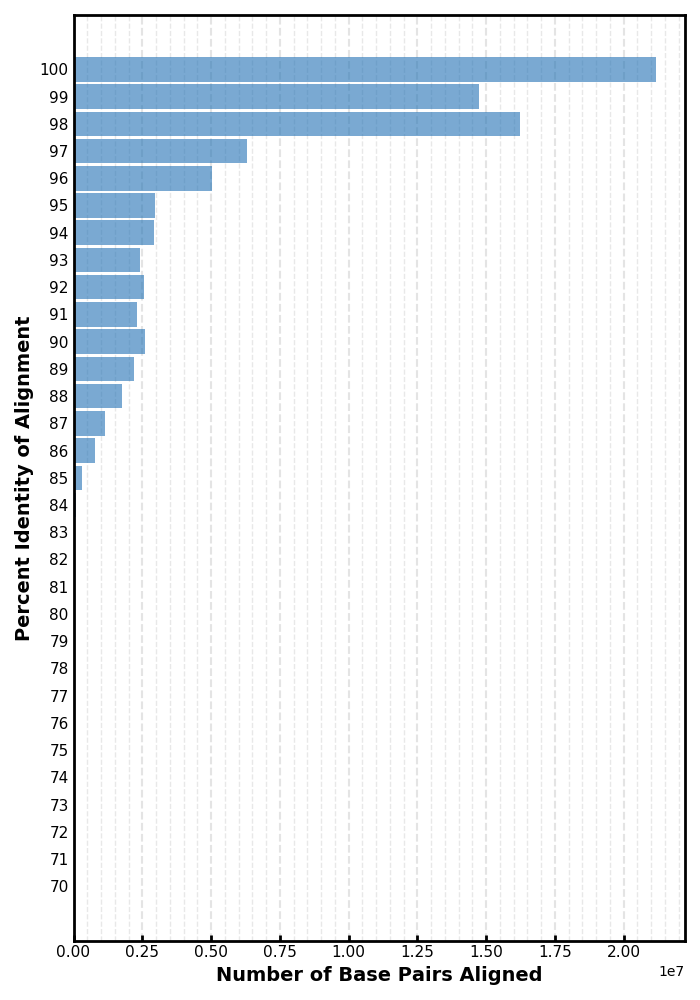
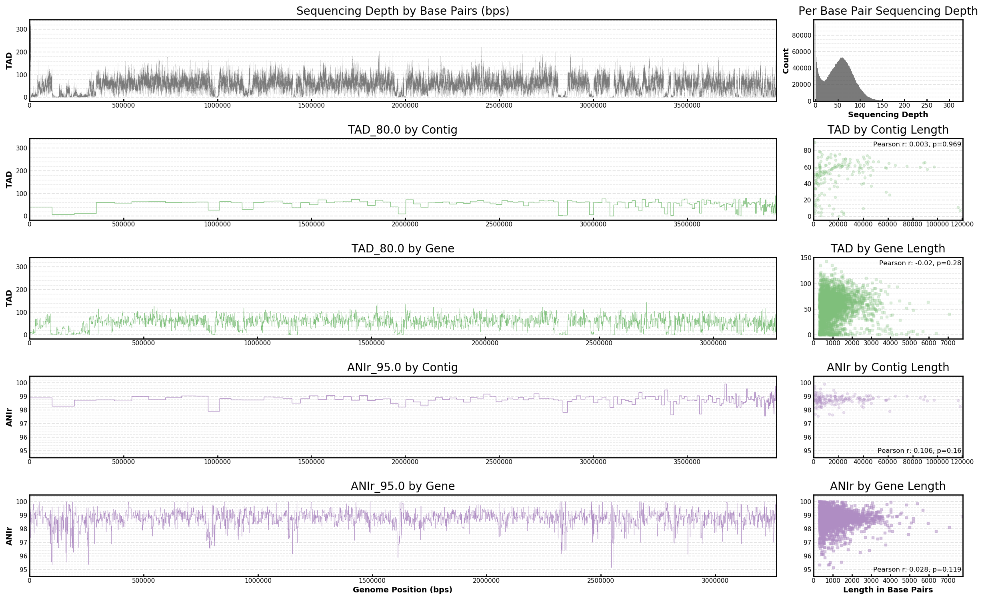

# Workflow to calculate ANIr and sequence coverage (depth and breadth) of genome(s) / MAG(s) from metagenomes by gene, intergenic region, contig, and whole genome.

This workflow produces separate files in tab separated value (tsv) format for ANIr, sequence depth, and sequence breadth for the genes, intergenic regions, and contigs of a genome / MAG in fasta format. It also produces a file containing sequence depth at each position of the genome as well as a file with results calculated for the whole genome sequence. tsv files can be easily opened in Excel, imported into Python with Pandas, or read into R for further analysis. There is also an option to generate some summary plots or construct a Data Table with whole genome results for multiple genomes / MAGs across many metagenome samples.

*This workflow can also be used with Genomic FASTA and CDS from genomic FASTA files retrieved from the [NCBI assembly database](https://www.ncbi.nlm.nih.gov/assembly/). In this case, skip the renaming step for sequence names in the reference fasta file in Step 01 and skip all of Step 02. Use the -n flag for NCBI in Step 03.*

#### Coverage calculated as Truncated Average Depth (TAD):
- TAD 80 removes the top 10% and bottom 10% of base pair depths and caluclates coverage from the middle 80% of values. Intended to reduce effects of conserved motif peaks and contig edge valleys.
- Coverage = base pairs recruited / length of genome, contig, intergenic region, or gene
- Set TAD to 100 for no truncatation.

#### Coverage calculated as Breadth:
- number of positions in reference sequence covered by at least one read alignment divided the length of the reference sequence.

#### Relative Abundance is calculated as:
- base pairs recruited / base pairs in metagenome * 100
- It is the percent of base pairs recruited out of the total base pairs sequenced in the metagenome.

#### ANIr is calculated as:
- average percent identity of sequence alignments for all reads (should be 1 blast match per read)

#### This workflow leads to the following result files:

- 3 column tsv output of Contig(or gene_name), coverage(or ANIr), sequence length.
- Writes 11 files total:
    - \{out_file_prefix\}_genome_by_bp.tsv
    - \{out_file_prefix\}_genome.tsv
    - \{out_file_prefix\}_contig_tad.tsv
    - \{out_file_prefix\}_contig_breadth.tsv
    - \{out_file_prefix\}_contig_anir.tsv
    - \{out_file_prefix\}_gene_tad.tsv
    - \{out_file_prefix\}_gene_breadth.tsv
    - \{out_file_prefix\}_gene_anir.tsv
    - \{out_file_prefix\}_intergene_tad.tsv
    - \{out_file_prefix\}_intergene_breadth.tsv
    - \{out_file_prefix\}_intergene_anir.tsv


## Step 00: Required tools :: Prodigal and Magic Blast.


### Prodigal for protein coding gene prediction.
 
Information and installation instructions for Prodigal can be found [here](https://github.com/hyattpd/Prodigal). The publication is [here](https://www.ncbi.nlm.nih.gov/pmc/articles/PMC2848648/).

Prodigal can also be installed with a [conda environment]():

```bash
conda create -n prodigal
conda activate prodigal
conda install -c bioconda prodigal
```

*If you're using files from the NCBI Assembly database you do not need Prodigal.*

### Magic Blast for short read metagenome mapping to reference genome(s) / MAG(s).

Information and installation instructions for Magic Blast can be found [here](https://ncbi.github.io/magicblast/). The publication is [here](https://bmcbioinformatics.biomedcentral.com/articles/10.1186/s12859-019-2996-x). NOTE: If the latest version of Magic Blast gives errors on your system, navigate to the parent directory and try a previous version.


## Step 01: Map metagenomic reads to reference genome(s) / MAG(s).

### Check metagenome read names and rename if needed. (fastq or fasta).

*Magic Blast cuts the query name at the first white space character and reports this as the query ID.*

>Fastq files can be named as:  
>    @D00468:261:HYTMHBCX2:1:1101:9119:31637 1:N:0:CAGAGAGG+ACTGCATA  
>    @D00468:261:HYTMHBCX2:1:1101:9119:31637 2:N:0:CAGAGAGG+ACTGCATA  
>where the unique identifier comes after the white space chacter.

*Filtering for best hit and retrieving the fasta sequence becomes impossible once the unique identifier is lost. Rename fastq files before running Magic Blast with fastq files. I typically assign a short unique sample name to my metagenome files (metagenomeID). I then rename the reads using this short metagenomeID and a read number like so: metagenomeID_readNumber. This can be accomplished using either script below depending if your reads are in fastq or fasta format.*

For fastq formatted metagenome read files:

```bash
python 01a_Fastq_rename_sequences.py -i metagenome_file_name.fastq -p metagenomeID
```

For fasta formatted metagenome read files:

```bash
python 01b_Fasta_rename_sequences.py -i metagenome_file_name.fastq -p metagenomeID
```

### Check sequence names in reference fasta files and rename if needed.

*Magic Blast truncates sequences names at 50 characters. Prodigal appends the predicted gene number to end of the sequence names of the contigs. Depending on how many genes you have (2000-8000 typical for microbial genome) your sequence names need to leave enough room to retain the gene number. I typically assign short unique genome identifiers (uniqueID) to the file names of my genomic fasta files or MAGs. I then rename the contigs in each fasta file using this short uniqueID and the contig number like so: uniqueID_contigNumber. This can be accomplished with the following script:*

```bash
python 01b_Fasta_rename_sequences.py -i genomic_fasta.fna -p uniqueID
```

*genomic_fasta.fna can be complete or draft genomes or a MAG. Any genomic sequence you are using as your reference sequence.*

### For individual genome or MAG:

1. Make Magic Blast database.

    *If you also have Blast+ installed on your system, make certain you are calling the makeblastdb program that comes with Magic Blast and not the version that comes with Blast+. Try: which makeblastdb*

    ```bash
    makeblastdb -dbtype nucl -in Combined_Genomes.fasta -out Combined_Genoems.fasta -parse_seqids
    ```

    *If you forget the -parse_seqids flag it will cause errors later.*

2. Run Magic Blast.

    *For the outfile_name of the -out flag use the naming scheme of uniqueID_metagenomeID.blast where uniqueID is the unique identifier for your genome or MAG.*

    ```bash
    magicblast -query {metagenome_fasta} -db Combined_Genomes.fasta -infmt (fasta or fastq) -no_unaligned -splice F -outfmt tabular -parse_deflines T -out {outfile_name}.blast
    ```

    *If you forget to set the 0parse_deflines flag to true it will cause errors later.*

3. Shuffle blast results.

    *The Magic Blast results are output in an ordered format. The filter script keeps the first best match which will bias the results. Using the blast command shuf will randomize the oder of the Magic Blast results file to prevent this bias.*

    ```bash
    shuf {outfile_name}.blast > {outfile_name}.shuf.blast
    ```

4. Filter results for best hits

    *Magic Blast will report multiple results per metagenomic read. For this analysis we only want to count each read once. Magic Blast will also report short sequence alignments of high identity. If a sequence alignment is 20 base pairs but the read is 150 base pairs this is considered to be a wrong match so we remove it. The -pml flag uses a ratio of alignment length / read length to identify results of this type. A value of 0.7, 0.8 or 0.9 is recommended.*

    ```bash
    python 01c_MagicBlast_ShortRead_Filter.py -i {outfile_name}.shuf.blast -pml 0.9 -rl 70
    ```


### Competitive read recruitment for multiple genomes or MAGs:

1. Append a unique identifier to the beginning of the sequence name for all contigs in the genome or MAG files

    Adjst the cut parameters to select a unique ID from your genomic fasta files to append to the begginging of your sequence names for each genome / MAG.

    ```bash
    for file in *.fna
        do
            uniqueID=`basename $file | cut -d _ -f 1
            sed -i "s/>/>${uniqueID}_/g" $file
        done
    ```

2. Concatenate all genomes / MAGs into a single fasta file.

    ```bash
    cat *.fna >> Combined_Genomes.fasta
    ```
    *Change .fna to match the file extention of your genomes / MAGs*

3. Make Magic Blast database.

    *If you also have Blast+ installed on your system, make certain you are calling the makeblastdb program that comes with Magic Blast and not the version that comes with Blast+*

    ```bash
    makeblastdb -dbtype nucl -in Combined_Genomes.fasta -out Combined_Genoems.fasta -parse_seqids
    ```

    *If you forget the -parse_seqids flag it will cause errors later*

4. Run Magic Blast

    *For the outfile_name of the -out flag use the naming scheme of uniqueID_metagenomeID.blast where uniqueID is the unique identifier for your genome or MAG.*

    ```bash
    magicblast -query {metagenome_fasta} -db Combined_Genomes.fasta -infmt (fasta or fastq) -no_unaligned -splice F -outfmt tabular -parse_deflines T -out uniqueID_metagenomeID.blast
    ```

5. Shuffle blast results

    ```bash
    shuf uniqueID_metagenomeID.blast > uniqueID_metagenomeID.shuf.blast
    ```

6. Filter results for best hits

    ```bash
    python 01_MagicBlast_ShortRead_Filter.py -i uniqueID_metagenomeID.shuf.blast -pml 0.9 -rl 70
    ```

6. De-concatenate

    ```bash
    for file in *.fna
        do
            uniqueID=`basename $file | cut -d _ -f 1`
            echo $uniqueID >> uniqueID_list.txt
        done

    while read uniqueID
        do
            grep $uniqueID uniqueID_metagenomeID.fltrdBstHts.blst >> uniqueID.blast
        done < uniqueID_list.txt
    ```


## Step 02: Predict protein coding genes with Prodigal.

As per the Prodigal documentation, Prodigal can be easily run like this:

```bash
prodigal -i genomic_fasta.fna -o my.genes -a my.proteins.faa
```

*We only care about the my.proteins.faa file for the purpose of this pipeline.*


## Step 03: Calculate ANIr and Coverage.

*The scripts takes 1 uniqueID.blast file at a time with its corresponding metagenome, genomic fasta, and predicted genes files. For the outfile_prefix of the -o flag use the naming scheme of uniqueID_metagenomeID where uniqueID is the unique identifier for your genome or MAG.*

```bash
python 03a_MagicBlast_CoverageMagic.py -m metagenomeID.fna -g uniqueID.fna -p my.proteins.faa -b uniqueID.blast -c 95 -d 80 -o uniqueID_metagenomeID (add -n if using NCBI Assembly files)
```

*If using Genomic FASTA and CDS from genomic FASTA files retrieved from the NCBI assembly database, the Genomic FASTA goes to the -g flag and CDS from genomic FASTA goes to the -p flag replacing the my.proteins.faa file from Prodigal.*

The -d flag is for the truncated average value or TAD parameter. A value of 100 will return results without truncation.

The -c flag is a cutoff threshold for the percent identity of the metagenomic read alignments to the genomic reference. Sequence discontinuity gaps for sequence discrete populations are generally observed around 95% percent sequence identity. This is a good starting point, but depending on your target population you may want to increase or decrease this value. Looking at the distribution of percent identity values or a recruitment plot is a great way to investigate the sequence discontinuity for your population of interest.

You can visualize your sequence identity distribution with a histogram using the following:

```bash
python 03b_MagicBlast_pIdent_Hist.py -i uniqueID.blast
```



Or you can use the [Enveomics collection](http://enve-omics.ce.gatech.edu/enveomics/index) to build a [recruitment plot](http://enve-omics.ce.gatech.edu/enveomics/docs?t=BlastTab.recplot2.R). There's even have a [GUI](http://enve-omics.ce.gatech.edu/enveomics/gui) to make things a bit easier.


## Step 04: Generate summary plots.

```bash
python 04a_MagicBlast_CoverageMagic_SummaryPlot.py -pre {outfile_prefix} -thd 95 -tad 80
```

Example plot:



## Step 05: Build Data Table of Whole Genome stats for multiple genomes across multiple metagenomes

Move all the genome.tsv files you want to place in the table into their own directory.

```bash
python 05_MagicBlast_CoverageMagic_CombineGenomeStats.py -gtd {genome.tsv directory} -o {outfile_name}
```